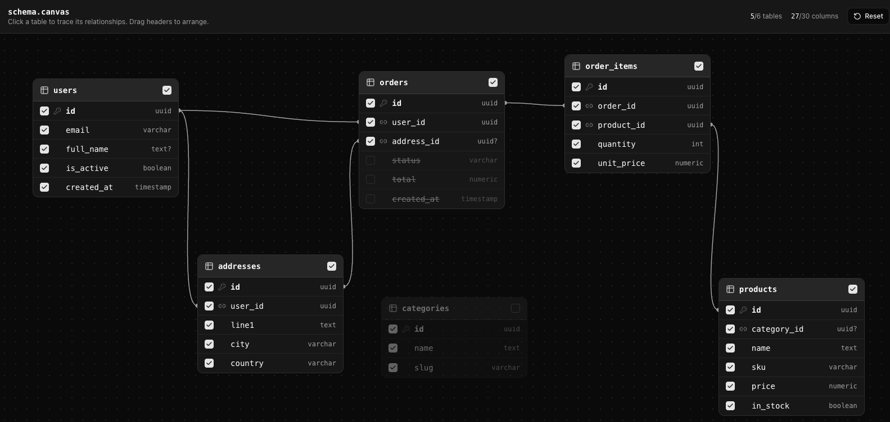

# DynamicQ

DynamicQ builds Entity Framework Core `IQueryable<T>` projections from a declarative list of tables and columns. It supports nested reference and collection navigations and can flatten the projected entity graph into a `System.Data.DataTable` for reporting and export scenarios.

DynamicQ is intentionally focused on projection. Filtering, sorting, paging, and aggregation remain standard LINQ operations.

## Requirements

- .NET 8
- Entity Framework Core 8

## Setup

Install the package from NuGet:

```bash
dotnet add package DynamicQ
```

Register DynamicQ and the entity paths that callers are allowed to select:

```csharp
using DynamicQuery.DataStructures;
using DynamicQuery.Extensions;

builder.Services.AddDynamicQ(options =>
{
    options.RegisteredTables = [
        new RegisteredTable(typeof(Blog),     "Blog",      "Blog",                   ["Content"]),
        new RegisteredTable(typeof(User),     "Owner",     "Blog.Owner",                    null),
        new RegisteredTable(typeof(Comment),  "Comments",  "Blog.Owner.Comments",           null),
        new RegisteredTable(typeof(Post),     "Post",      "Blog.Owner.Comments.Post",      null),
        new RegisteredTable(typeof(Reaction), "Reactions", "Blog.Owner.Comments.Reactions", null)
    ];
});
```

`AddDynamicQ` registers these services as singletons:

- `DynamicQ`
- `DataTableBuilderService`

The package name is `DynamicQ`; its C# namespaces begin with `DynamicQuery`.

## Registering tables

Every path accepted from a request must have a `RegisteredTable`:

```csharp
new RegisteredTable(
    TableType: typeof(Comment),
    VirtualNavigationName: "Comments",
    PathToTable: "Blog.Owner.Comments",
    ExcludedColumns: null);
```

- `TableType` is the CLR entity type at that path.
- `VirtualNavigationName` is the navigation property name on the parent entity. Use the root name for the root registration.
- `PathToTable` is the complete, dot-separated path accepted in requests.
- `ExcludedColumns` contains properties that must not be projected, such as sensitive or large fields.

Register the same CLR type more than once when it is reachable through different navigation paths. Each registration needs the path and navigation name for that specific relationship.

Paths and requested property names should use the exact casing from the registration and entity classes.

## Basics

DynamicQ usage has three steps:

1. Convert a declarative request into a `DynamicQTableTree`.
2. Apply the tree to an EF Core query.
3. Materialize the resulting `IQueryable<T>`.

First, create a request:

```csharp
using DynamicQuery.Models;

var request = new DynamicQTableRequest
{
    TableSelection =
    [
        new DynamicQSelectedFields
        {
            PathToTable = "Blog",
            SelectedTableColumns = ["BlogId", "Title", "CreatedAt"]
        },
        new DynamicQSelectedFields
        {
            PathToTable = "Blog.Owner",
            SelectedTableColumns = ["UserId", "UserName", "DisplayName"]
        },
        new DynamicQSelectedFields
        {
            PathToTable = "Blog.Owner.Comments",
            SelectedTableColumns = ["CommentId", "Body", "CreatedAt"]
        },
        new DynamicQSelectedFields
        {
            PathToTable = "Blog.Owner.Comments.Post",
            SelectedTableColumns = ["PostId", "Title"]
        }
    ]
};
```

Next, create and execute the projected query:

```csharp
using DynamicQuery;
using Microsoft.EntityFrameworkCore;

var tableTree = dynamicQ.CreateTableTree(request);

if (tableTree is null || tableTree.JoinNodes.Count == 0)
{
    throw new ArgumentException("The request does not contain a valid table selection.");
}

var source = db.Blogs
    .AsNoTracking()
    .Where(blog => blog.CreatedAt >= startDate)
    .OrderBy(blog => blog.Title);

var blogs = await dynamicQ
    .CreateProjectedQuery(source, tableTree)
    .ToListAsync(cancellationToken);
```

The result is still `List<Blog>`, but only the requested scalar properties and navigation shapes are initialized. Unselected properties have their CLR default values. These are partially initialized entity instances, not DTOs or fully loaded entities; do not treat omitted properties as database values or use the results for updates.

Reference navigations are projected as nested entities. Collection navigations are projected as lists:

```text
Blog
└── Owner
    └── Comments[]
        └── Post
```

DynamicQ applies the required EF Core includes and builds the corresponding `Select` expression. The returned value remains an `IQueryable<T>`, so execution stays deferred until it is materialized.

## Accepting a request from an API

`DynamicQTableRequest` can be bound directly from JSON. A request body looks like this:

```json
{
  "tableSelection": [
    {
      "pathToTable": "Blog",
      "selectedTableColumns": ["BlogId", "Title"]
    },
    {
      "pathToTable": "Blog.Owner",
      "selectedTableColumns": ["UserName", "Email"]
    },
    {
      "pathToTable": "Blog.Owner.Comments",
      "selectedTableColumns": ["CommentId", "Body"]
    }
  ]
}
```

Example minimal API endpoint:

```csharp
app.MapPost("/blogs/query", async (
    DynamicQTableRequest request,
    AppDbContext db,
    DynamicQ dynamicQ,
    CancellationToken cancellationToken) =>
{
    var tableTree = dynamicQ.CreateTableTree(request);

    if (tableTree is null || tableTree.JoinNodes.Count == 0)
    {
        return Results.BadRequest("No valid tables or columns were selected.");
    }

    var result = await dynamicQ
        .CreateProjectedQuery(db.Blogs.AsNoTracking(), tableTree)
        .ToListAsync(cancellationToken);

    return Results.Ok(result);
});
```

Registered paths act as a table/navigation allowlist. Columns listed in `ExcludedColumns` are removed from the selection. Applications should still validate malformed or empty requests and apply their own authorization rules before executing a query.

## Creating a selector

Use `CreateSelector<T>` when an expression is more useful than a completed query:

```csharp
var tableTree = dynamicQ.CreateTableTree(request)
    ?? throw new ArgumentException("Invalid table selection.");

var selector = dynamicQ.CreateSelector<Blog>(tableTree);
var blogs = await db.Blogs
    .AsNoTracking()
    .Select(selector)
    .ToListAsync(cancellationToken);
```

The selector has the type `Expression<Func<Blog, Blog>>`.

## Flattening results to a DataTable

Inject `DataTableBuilderService` and use the same tree that produced the entity projection:

```csharp
var tableTree = dynamicQ.CreateTableTree(request)
    ?? throw new ArgumentException("Invalid table selection.");

var blogs = await dynamicQ
    .CreateProjectedQuery(db.Blogs.AsNoTracking(), tableTree)
    .ToListAsync(cancellationToken);

DataTable dataTable = dataTableBuilder.FlattenToDataTable(blogs, tableTree);
```

Generated column names are ordered and include their navigation name:

```text
1.Blog_BlogId
2.Blog_Title
3.Owner_UserName
4.Comments_CommentId
5.Comments_Body
```

Collection values expand into multiple rows. For example, a blog with two selected comments produces two rows containing the repeated blog and owner values. Selecting multiple collection branches can multiply rows, so consider the possible result size before flattening a large graph.

Null reference navigations and empty collections produce default values for their selected columns. Enum columns are represented as strings, using `DisplayAttribute.Name` when one is defined.

## Building a table tree manually

For trusted, code-defined projections, a tree can be constructed without `DynamicQTableRequest`:

```csharp
using DynamicQuery.DataStructures;

var tableTree = new DynamicQTableTree
{
    StartingTable = "Blog",
    JoinNodes =
    [
        new DynamicQNode
        {
            TableType = typeof(Blog),
            SelectedTableColumns = ["BlogId", "Title"],
            MinimalIncludePath = [],
            OriginalIncludePath = null
        },
        new DynamicQNode
        {
            TableType = typeof(User),
            SelectedTableColumns = ["UserName", "DisplayName"],
            MinimalIncludePath = ["Owner"],
            OriginalIncludePath = "Owner"
        },
        new DynamicQNode
        {
            TableType = typeof(Comment),
            SelectedTableColumns = ["CommentId", "Body"],
            MinimalIncludePath = ["Owner", "Comments"],
            OriginalIncludePath = "Owner.Comments"
        }
    ]
};

var blogs = await dynamicQ
    .CreateProjectedQuery(db.Blogs.AsNoTracking(), tableTree)
    .ToListAsync(cancellationToken);
```

`CreateProjectedQuery`, `CreateSelector`, and `FlattenToDataTable` call `Build()` automatically. Manual trees are intended for trusted application code because they bypass the registered-path request validation performed by `CreateTableTree`.

## Filtering, sorting, paging, and aggregation

DynamicQ does not define a custom language for these operations. Apply normal LINQ to the source query:

```csharp
var source = db.Blogs
    .AsNoTracking()
    .Where(blog => blog.OwnerUserId == ownerId)
    .OrderByDescending(blog => blog.CreatedAt)
    .Skip(pageIndex * pageSize)
    .Take(pageSize);

var query = dynamicQ.CreateProjectedQuery(source, tableTree);
```

Applying these operations before projection allows them to use properties that are not part of the returned shape.

## Request behavior and limitations

- Only paths present in `RegisteredTables` are included when a request tree is created.
- Excluded columns are removed from incoming selections.
- Unknown property names are not projected. Validate client input when rejected fields need to produce an error.
- DynamicQ returns partially initialized entity types, not DTOs or anonymous objects.
- `DefaultTables` exists in the options model but automatic lookup-table joins are not implemented.
- Dynamic filtering, sorting, aggregation, and authorization are the application's responsibility.
- Keep registrations and client-selectable columns intentionally narrow when requests originate outside the application.


## Example UI implementation

